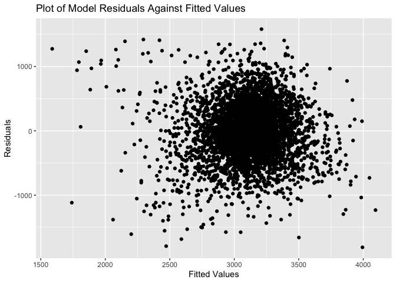
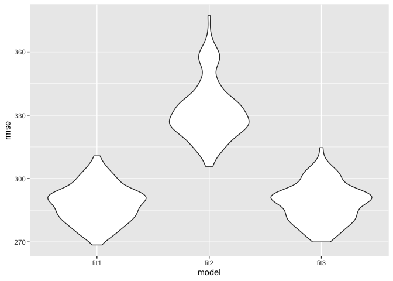
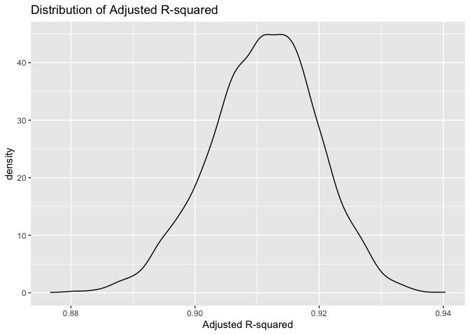
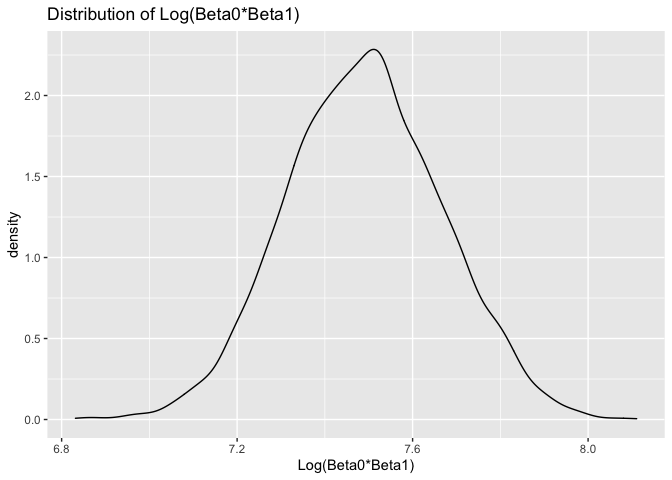

Homework 6
================
Zoey Zhao
12/4/2021

# Problem 1

### Build a model

Considering baby’s birth weight as a outcome might depend on mother’s
age, baby’s length and head circumference.

``` r
birthweight<- 
  read_csv("./data/birthweight.csv")%>%
  mutate(babysex = as.factor(babysex))%>%
  na.omit()

fit1 <- lm(bwt ~ momage + blength + bhead + blength*bhead +  momage*blength +momage*bhead + momage*blength*bhead, data = birthweight)

fit1%>%
  broom::tidy() %>% 
  knitr::kable(digits = 3)
```

| term                 |  estimate | std.error | statistic | p.value |
|:---------------------|----------:|----------:|----------:|--------:|
| (Intercept)          | 12337.376 |  4722.127 |     2.613 |   0.009 |
| momage               |  -836.642 |   240.664 |    -3.476 |   0.001 |
| blength              |  -276.060 |    98.109 |    -2.814 |   0.005 |
| bhead                |  -432.312 |   142.930 |    -3.025 |   0.003 |
| blength:bhead        |    11.289 |     2.937 |     3.844 |   0.000 |
| momage:blength       |    16.373 |     4.979 |     3.288 |   0.001 |
| momage:bhead         |    26.375 |     7.260 |     3.633 |   0.000 |
| momage:blength:bhead |    -0.512 |     0.149 |    -3.445 |   0.001 |

``` r
birthweight %>% 
  modelr::add_residuals(fit1) %>% 
  modelr::add_predictions(fit1)%>%
  ggplot(aes(x = pred, y = resid)) + geom_point() +
  labs(title = "Plot of Model Residuals Against Fitted Values",
       x = "Fitted Values",
       y = "Residuals")
```

<!-- -->
\#\#\# Cross validation

``` r
fit2 = lm(bwt ~ blength + gaweeks, data = birthweight)

fit3 = lm(bwt ~ blength + bhead + babysex + blength*bhead + bhead*babysex + blength*babysex + blength*babysex*bhead, data = birthweight)
```

``` r
cv_df =
  crossv_mc(birthweight, 100) %>% 
  mutate(
    train = map(train, as_tibble),
    test = map(test, as_tibble))

cv_df = 
  cv_df %>% 
  mutate(
    fit1  = map(train, ~lm(bwt ~ momage + blength + bhead + blength*bhead +  momage*blength +momage*bhead + momage*blength*bhead, data = .x)),
    fit2  = map(train, ~lm(bwt ~ blength + gaweeks, data = .x)),
    fit3  = map(train, ~lm(bwt ~ blength + bhead + babysex + blength*bhead + bhead*babysex + blength*babysex + blength*babysex*bhead, data = .x))) %>% 
  mutate(
    rmse_fit1 = map2_dbl(fit1, test, ~rmse(model = .x, data = .y)),
    rmse_fit2 = map2_dbl(fit2, test, ~rmse(model = .x, data = .y)),
    rmse_fit3 = map2_dbl(fit3, test, ~rmse(model = .x, data = .y)))

cv_df %>% 
  select(starts_with("rmse")) %>% 
  pivot_longer(
    everything(),
    names_to = "model", 
    values_to = "rmse",
    names_prefix = "rmse_") %>% 
  mutate(model = fct_inorder(model)) %>% 
  ggplot(aes(x = model, y = rmse)) + geom_violin()
```

<!-- -->
According to the result of cross-validation, the RMSEs for the first and
the third model are smaller than the second one, indicating that the
second model might not be as good as the first and the third one.

# Problem 2

``` r
weather_df = 
  rnoaa::meteo_pull_monitors(
    c("USW00094728"),
    var = c("PRCP", "TMIN", "TMAX"), 
    date_min = "2017-01-01",
    date_max = "2017-12-31") %>%
  mutate(
    name = recode(id, USW00094728 = "CentralPark_NY"),
    tmin = tmin / 10,
    tmax = tmax / 10) %>%
  select(name, id, everything())
```

``` r
fit4 <-
  lm(tmax ~ tmin, data = weather_df) 

fit4%>% 
  broom::tidy() %>% 
  knitr::kable(digits = 3)
```

| term        | estimate | std.error | statistic | p.value |
|:------------|---------:|----------:|----------:|--------:|
| (Intercept) |    7.209 |     0.226 |    31.847 |       0 |
| tmin        |    1.039 |     0.017 |    61.161 |       0 |

Use 5000 bootstrap samples and, for each bootstrap sample, produce
estimates of these two quantities.

``` r
boot_sample <- function(df) {
  sample_frac(df, replace = TRUE)
}

boot_straps = 
  tibble(
    strap_number = 1:5000,
    strap_sample = rerun(5000, boot_sample(weather_df))
  )
```

``` r
bootstrap_results <- 
  boot_straps %>% 
  mutate(
    models = map(strap_sample, ~lm(tmax ~ tmin, data = .x) ),
    results = map(models, broom::glance)) %>% 
  select(-strap_sample, -models) %>% 
  unnest(results) 

bootstrap_results%>%
  summarize(
    ci_lower = quantile(adj.r.squared, 0.025), 
    ci_upper = quantile(adj.r.squared, 0.975))
```

    ## # A tibble: 1 × 2
    ##   ci_lower ci_upper
    ##      <dbl>    <dbl>
    ## 1    0.893    0.927

``` r
bootstrap_results %>% 
  ggplot(aes(x = adj.r.squared)) + geom_density() +
  labs(title = "Distribution of Adjusted R-squared",
       x = "Adjusted R-squared")
```

<!-- -->

The distribution of adjusted R-squared is approximately normal with a
non-obvious tail extending to low values.

``` r
bootstrap_results2 <- 
  boot_straps %>% 
  mutate(
    models = map(strap_sample, ~lm(tmax ~ tmin, data = .x) ),
    results = map(models, broom::tidy)) %>% 
  select(-strap_sample, -models) %>% 
  unnest(results)

log_product<-
  bootstrap_results2 %>% 
  select(term, estimate)%>%
  pivot_wider(names_from = term, values_from = estimate)%>%
  unnest()%>%
  janitor::clean_names()%>%
  mutate(log_product = log(intercept*tmin))%>%
  select(log_product)
```

    ## Warning: Values are not uniquely identified; output will contain list-cols.
    ## * Use `values_fn = list` to suppress this warning.
    ## * Use `values_fn = length` to identify where the duplicates arise
    ## * Use `values_fn = {summary_fun}` to summarise duplicates

    ## Warning: `cols` is now required when using unnest().
    ## Please use `cols = c(`(Intercept)`, tmin)`

``` r
log_product%>%
  summarize(
    ci_lower = quantile(log_product, 0.025), 
    ci_upper = quantile(log_product, 0.975))
```

    ## # A tibble: 1 × 2
    ##   ci_lower ci_upper
    ##      <dbl>    <dbl>
    ## 1     1.97     2.06

``` r
log_product %>% 
  ggplot(aes(x = log_product)) + geom_density() +
  labs(title = "Distribution of Log(Beta0*Beta1)",
       x = "Log(Beta0*Beta1)")
```

<!-- -->

The distribution of log(beta0\*beta1) is approxiamtely normal.
